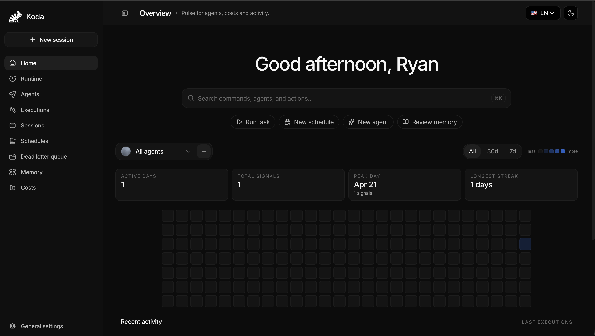

<div align="center" style="display: flex; align-items: center; justify-content: center; margin-bottom: 10px; width: 100%; background-color: #000000;">
  
</div>

<p align="center">
  <strong>Open-source harness for orchestrating multi-agent, multi-provider AI systems.</strong>
</p>

<p align="center">
  Bring up the platform stack first. Configure providers, agents, access, secrets, and operations through Koda itself.
</p>

<p align="center">
  <a href="docs/install/local.md"></a>
  <a href="docs/README.md"></a>
  <a href="docs/reference/api.md"></a>
  <a href="docs/architecture/overview.md"></a>
</p>

<p align="center">
  <a href="docs/install/local.md"></a>
  <a href="docs/install/local.md"></a>
  <a href="docs/reference/api.md"></a>
  <a href="docs/architecture/runtime.md"></a>
</p>

<p align="center">
  
</p>

<p align="center">
  <a href="docs/install/local.md"><strong>Install locally</strong></a>
  ·
  <a href="docs/install/vps.md"><strong>Deploy on a VPS</strong></a>
  ·
  <a href="docs/config/reference.md"><strong>Configuration reference</strong></a>
  ·
  <a href="docs/openapi/control-plane.json"><strong>OpenAPI</strong></a>
</p>

Koda is a control-plane-first platform for orchestrating AI agents with durable state, object storage, knowledge retrieval, memory recall, runtime inspection, and operator-facing setup flows. It is designed to act as a harness: you bring the providers, prompts, policies, and task shapes that fit your use case, and Koda supplies the operational runtime around them.

This repository is the canonical open-source monorepo for Koda. It combines:

- the Python platform backend at the repository root
- the official Next.js operations UI in `apps/web`
- public docs, OpenAPI, Docker assets, and contributor guidance in one place

The public quickstart brings up the platform stack first. Product configuration such as providers, access policy, secrets, agents, and integrations is completed through the control plane and its API surface.

## Quickstart

1. Install the npm CLI or use `npx`.
2. Run the installer.
3. Open the dashboard and finish bootstrap in the control plane.

```bash
npm install -g koda
koda install
```

Repository contributors can still use the source wrapper:

```bash
git clone https://github.com/OpenKodaAI/koda.git /opt/koda
cd /opt/koda
./scripts/install.sh
```

When the installer completes, start in the dashboard:

- Dashboard setup: `http://127.0.0.1:3000/control-plane`
- Dashboard home: `http://127.0.0.1:3000`

From there you can unlock the operator session, validate platform health, configure access, connect a provider, and create your first agent without editing per-agent `.env` values.
From the control plane you can also connect and verify integrations, inspect `connection_status` and health, and then grant those integrations per bot through the agent contract instead of relying on ambient system-wide access.

## What The Stack Starts

- `web` on port `3000` for the operator-facing UI
- `app` on port `8090` for `/health`, `/setup` compatibility, `/api/control-plane/*`, and `/api/runtime/*`
- `postgres` for durable state
- `seaweedfs` plus `seaweedfs-init` for bundled S3-compatible object storage

## Control Plane Surface

The operational UI is part of the product itself. The dashboard runs as the official web frontend and proxies control-plane and runtime calls back to the backend:

<p align="center">
  
</p>

## What Koda Includes

- A control plane for provider configuration, agent management, secrets, and operational settings
- A dedicated web dashboard for first-run setup, operations, runtime inspection, and control-plane workflows
- A runtime API for inspection, orchestration, command execution, and runtime supervision
- Postgres-backed durable state for runtime, control-plane, knowledge, memory, and audit records
- SeaweedFS-backed bundled object storage for the quickstart path through a generic S3-compatible contract
- Retrieval, memory, and artifact services aligned behind typed internal contracts
- Docker-first deployment for local environments and single-node VPS installs
- A purpose-agnostic harness that can back research, operations, automation, support, engineering, or domain-specific agent workflows

## Core Capabilities

- Control-plane-first bootstrap with first-run setup directly in the web dashboard instead of hand-maintained per-agent env files
- Multi-agent orchestration with isolated runtime state, prompt contracts, and operational settings
- Multi-provider execution so each agent can be configured for the models and tools that fit its role
- Harness-style architecture that lets operators define agents for any niche, workflow, or task class
- Durable artifact processing for documents, media, screenshots, and derived evidence
- Knowledge retrieval and memory recall to ground agent execution with relevant context
- Runtime visibility through health, setup, dashboard, control-plane, and OpenAPI-backed public surfaces
- Provider-agnostic architecture with explicit setup and verification flows
- Production-friendly quickstart with Postgres, SeaweedFS, health checks, and doctor tooling

## How The Platform Is Structured

Koda is organized around a few stable layers:

- **Web UI:** Next.js operator interface in `apps/web`
- **Control plane:** setup, policy, secrets, provider connections, agent definitions, and public onboarding routes
- **Runtime:** execution supervision, queue orchestration, runtime APIs, and agent tool dispatch
- **Knowledge and memory:** retrieval, recall, curation, and context assembly
- **Artifacts and storage:** durable metadata, object-backed binaries, and evidence generation
- **Infrastructure:** Docker, Postgres, bundled S3-compatible storage, health checks, and operator tooling

For a public architecture walkthrough, start with [Documentation Index](docs/README.md), [Architecture Overview](docs/architecture/overview.md), and [Runtime Architecture](docs/architecture/runtime.md).

## Installation Paths

- [Local install](docs/install/local.md)
- [VPS install](docs/install/vps.md)
- [Object storage migration](docs/install/object-storage-migration.md)
- [Configuration reference](docs/config/reference.md)

## Public Interfaces

- `/` for the main operations dashboard served by `apps/web`
- `/control-plane` in `apps/web` as the canonical first-boot configuration surface
- `/setup` as a compatibility bridge into the dashboard setup flow
- `/api/control-plane/agents/*` for canonical agent-management operations
- `/api/control-plane/dashboard/agents/*` for canonical operational dashboard data
- `/api/runtime/*` for runtime inspection and control
- [`docs/openapi/control-plane.json`](docs/openapi/control-plane.json) as the maintained public API contract
- [API reference](docs/reference/api.md) for an operator-facing summary of the HTTP surface

## Development

Backend development:

```bash
pip install -e ".[dev]"
ruff check .
ruff format --check .
mypy koda/ --ignore-missing-imports
pytest --cov=koda --cov-report=term-missing
```

Web development:

```bash
pnpm install
cp apps/web/.env.example apps/web/.env.local
pnpm dev:web
```

Containerized local development with live reload:

```bash
pnpm dev:stack:build
```

This development stack mounts the repository directly into the `app` and `web` containers, runs the web UI in Next.js development mode, restarts the control-plane backend automatically on source changes, and keeps frontend build output ephemeral so UI changes are not served from an old image layer. The dev frontend image also pre-seeds the package store and `node_modules` cache so the first boot is much faster than rebuilding the production image on each edit. When dependency manifests change, restarting the dev stack reapplies installs automatically.

## Documentation

- [Documentation index](docs/README.md)
- [Architecture overview](docs/architecture/overview.md)
- [Runtime architecture](docs/architecture/runtime.md)
- [Security readiness](docs/security/README.md)
- [API reference](docs/reference/api.md)
- [Local install](docs/install/local.md)
- [VPS install](docs/install/vps.md)
- [Configuration reference](docs/config/reference.md)
- [Contributing](CONTRIBUTING.md)
- [Security policy](SECURITY.md)
- [Code of conduct](CODE_OF_CONDUCT.md)

## Contributing, Security, And Licensing

Contributors should start with [CONTRIBUTING.md](CONTRIBUTING.md) for local setup, validation, and documentation expectations. Security-sensitive reporting guidance lives in [SECURITY.md](SECURITY.md), and community participation expectations live in [CODE_OF_CONDUCT.md](CODE_OF_CONDUCT.md).

For the application-security baseline, threat model, ASVS mapping, and operational hardening checklist, use [docs/security/README.md](docs/security/README.md).

Koda is published under the Apache-2.0 license.

## Developer And AI-Friendly Entry Points

- [AGENTS.md](AGENTS.md)
- [CLAUDE.md](CLAUDE.md)
- [docs/ai/repo-map.yaml](docs/ai/repo-map.yaml)
- [docs/ai/llm-compatibility.md](docs/ai/llm-compatibility.md)
- [docs/ai/architecture-overview.md](docs/ai/architecture-overview.md)
- [docs/ai/runtime-flows.md](docs/ai/runtime-flows.md)
- [docs/ai/configuration-and-prompts.md](docs/ai/configuration-and-prompts.md)

## Validation

```bash
ruff check .
ruff format --check .
mypy koda/ --ignore-missing-imports
pytest --cov=koda --cov-report=term-missing
pnpm lint:web
pnpm test:web
pnpm build:web
python3 scripts/generate_repo_map.py --check
pytest -q tests/test_ai_docs.py tests/test_repo_map.py tests/test_open_source_hygiene.py
```

If you touch the Rust workspace, also run:

```bash
cargo fmt --check --manifest-path rust/Cargo.toml
cargo clippy --manifest-path rust/Cargo.toml --workspace --all-targets -- -D warnings
cargo test --manifest-path rust/Cargo.toml --workspace
```

## GitHub CI

Koda validates pull requests with a tiered GitHub Actions pipeline:

- `pr-quality` runs required checks for Python quality, Python tests on 3.11 and 3.12, web lint/test/build, repo-hygiene, Rust validation, and Docker smoke coverage
- `security` runs dependency audits, Bandit, Gitleaks, CodeQL, and container scanning on pull requests, on `main`, and on a weekly schedule

Coverage thresholds are sourced from [pyproject.toml](pyproject.toml), not duplicated in workflow files. GitHub uploads `pytest`/coverage artifacts, `vitest` results, and SARIF findings so failures can be reviewed directly in artifacts or in the Security tab.
