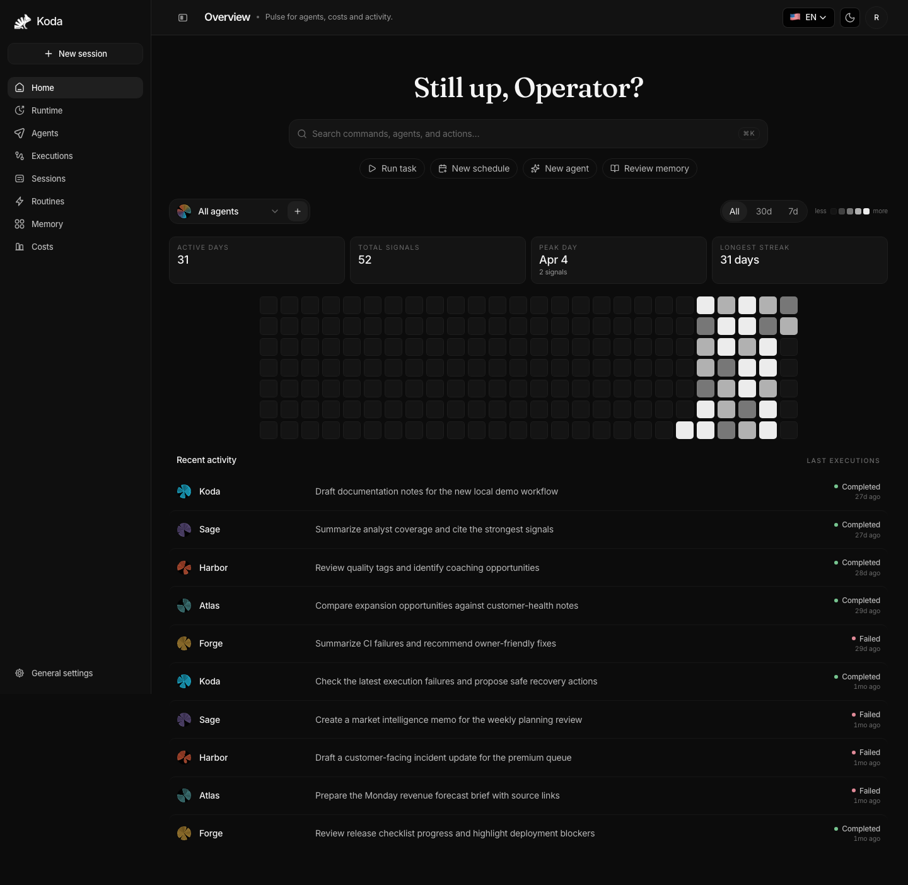
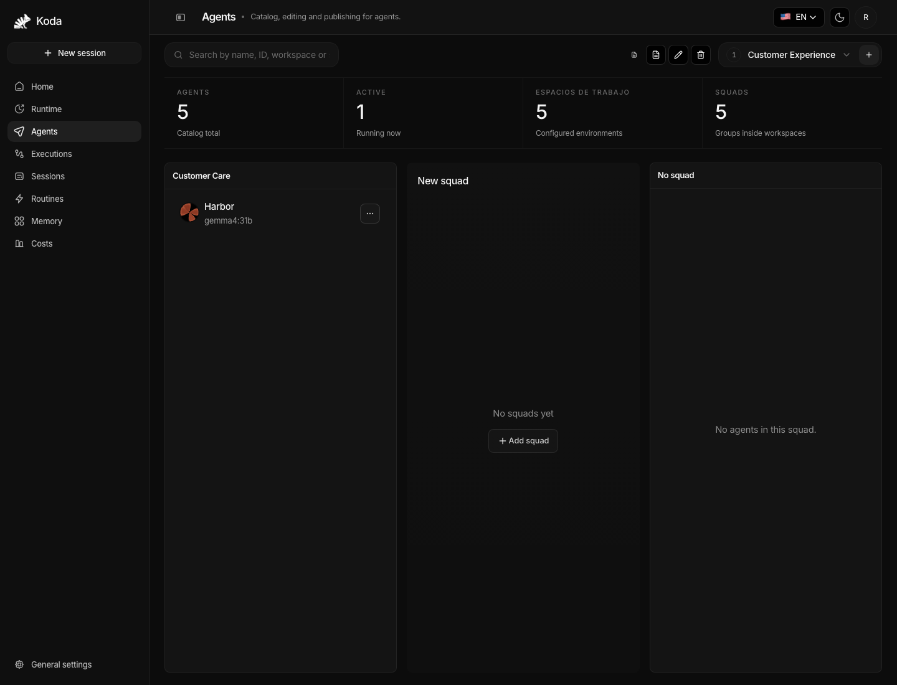
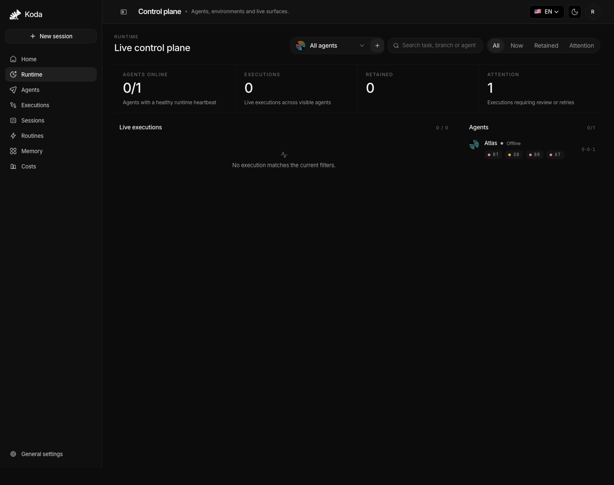

<p align="center">
  
</p>

<h1 align="center">Koda</h1>

<p align="center">
  <strong>Open-source harness for multi-agent, multi-provider AI systems.</strong>
</p>

<p align="center">
  <a href="docs/README.md"></a>
  <a href="docs/reference/api.md"></a>
  
  <a href="LICENSE"></a>
</p>

Koda is the operational layer around AI agents: a local-first, control-plane-first dashboard, runtime queue, memory system, skill system, channel gateway, eval harness, audit trail, and release-quality surface for teams that need agents to do real work without disappearing into a black box.

Configure providers, prompts, tools, secrets, agents, squads, memory policy, channel identity, and runtime safety from the dashboard. The workers follow the published contract; operators keep the evidence.

**Use the providers that fit your stack.** Koda supports OpenAI-compatible and native provider paths through the control plane, including OpenAI, Anthropic, Google, Groq, Mistral, OpenRouter, DeepSeek, Qwen, Kimi, Perplexity, xAI, Ollama, llama.cpp, MLX, Kokoro, Whisper, and other configured endpoints.

**Coordinate agents as squads, not just one-off chats.** Squad Rooms, reply obligations, handoffs, route explanations, child runs, synthesis gates, and RunGraph evidence make collaboration visible and auditable.

**Give memory guardrails before giving it power.** Namespaced recall, memory safety scanning, redacted provenance, stale/conflict handling, utility feedback, and context-governance drops keep memory useful without silently trusting unsafe context.

**Improve agents through governed proposals.** `improvement_proposal.v1` turns eval failures, user corrections, tool failures, timeouts, and manual signals into reviewable proposals with evidence refs, validation plans, rollback plans, audit, metrics, and RunGraph lifecycle nodes. Koda does not auto-mutate prompts, skills, policy, or memory without approval.

**Install skills without bypassing supply-chain checks.** `koda_skill.v1`, scanner decisions, package locks, eval evidence, recommendation status, strict per-agent allowlists, and rollback state keep skills local-first and reversible.

**Prove behavior with evals, smokes, and traces.** `eval_case.v1`, squad golden evals, `run_graph_completeness.v1`, `release_quality.v1`, trajectory export, quality cockpit, Prometheus metrics, Grafana dashboards, and ops benchmarks give the platform a measurable release gate.

---

## Quick Install

### npm installer

```bash
npm install -g @openkodaai/koda
koda install
```

Or run without a global install:

```bash
npx @openkodaai/koda@latest install
```

When the installer finishes, open:

- Setup: `http://127.0.0.1:3000/setup`
- Dashboard: `http://127.0.0.1:3000`
- Control Plane: `http://127.0.0.1:3000/control-plane`
- API health: `http://127.0.0.1:8090/health`

First boot is intentionally small:

```text
open /setup
  -> paste the short-lived setup code
  -> create the owner account
  -> save recovery codes
  -> sign in to the dashboard
```

### Source install

Use the repository wrapper on apt-based Linux hosts:

```bash
git clone https://github.com/OpenKodaAI/koda.git /opt/koda
cd /opt/koda
./scripts/install.sh
```

On macOS or other environments, install Docker and Node.js yourself and use the npm CLI path. Windows users should prefer WSL2 for the most predictable local setup.

---

## Getting Started

```bash
koda install              # install or refresh the local release bundle
koda up                   # start the stack if it is stopped
koda doctor               # inspect Docker, ports, env, API, and sandbox readiness
koda auth issue-code      # issue a setup/login code from the local install
koda logs app web         # tail release services
koda update               # move the install to the latest published bundle
koda down                 # stop the local stack
```

Typical first workflow:

1. Open `/setup`, create the owner account, and save recovery codes.
2. Connect at least one model provider in `/control-plane/system/models`.
3. Create or edit an agent in `/control-plane`.
4. Send work from `/sessions`, Telegram, or the runtime API.
5. Inspect execution, artifacts, RunGraph, cost, memory, and release-quality evidence from the dashboard.

[Full documentation](docs/README.md)

---

## Dashboard vs Channel Quick Reference

Koda has two operator surfaces: the dashboard for configuration and inspection, and the channel gateway for approved remote interaction. Telegram is the primary live channel path; Slack and Discord adapters share the same `channel_gateway.v1` contract and are validated locally unless live credentials are supplied.

| Action | Dashboard | Channel gateway |
| --- | --- | --- |
| First setup | `/setup` | Not applicable until owner setup is complete |
| Configure providers | `/control-plane/system/models` | Not exposed to channels |
| Configure agents | `/control-plane` | Not exposed to channels |
| Start work | `/sessions`, `/runtime`, runtime API | Approved Telegram identity or group mention |
| Squad coordination | Squad Room transcript | Group mention routes into the same squad delivery path |
| Inspect evidence | Runtime panels, RunGraph, evals, quality cockpit | Receives final response; evidence stays in Koda |
| Approve/block identity | Channel gateway UI/API | Pairing code, approved sender, block, revoke |
| Diagnose release readiness | Evals, release quality, sandbox doctor | Channel smoke and gateway metrics |

---

## What Koda Runs

```text
Operator browser
      |
      v
Next.js dashboard :3000
      |
      v
Python control plane :8090
      |
      +--> Postgres durable state
      +--> S3-compatible object storage
      +--> Rust sidecars: security, memory, artifact, retrieval, runtime-kernel
                         |
                         v
                  agent workers + provider CLIs
```

The default compose stack starts:

- `web` on `3000`
- `app` on `8090`
- `postgres`
- `SeaweedFS` (`seaweedfs` and `seaweedfs-init`) for S3-compatible object storage
- Rust sidecars for security, memory, artifacts, retrieval, and runtime supervision

Koda keeps infrastructure bootstrap and product configuration separate. `.env` brings up the platform; the dashboard and `/api/control-plane/*` own providers, agents, secrets, prompts, integrations, and runtime policy.

---

## Core Capabilities

| Area | What Koda provides |
| --- | --- |
| Control plane | Owner setup, provider connections, model defaults, agent catalog, workspaces, squads, secrets, tool policy, rollout state |
| Runtime | Queue manager, task rooms, browser and terminal access, artifacts, child runs, recovery, DLQ, schedules |
| Squads | Squad Rooms, mentions, reply obligations, handoffs, route scoring, synthesis readiness, transcript-visible coordination |
| Memory | Safety scanner, namespaces, provenance, recall explanations, stale/conflict drops, utility feedback, quality counters |
| Self-improvement | Governed proposal queue, eval-failure proposals, validation before apply, rollback ledger, audit and metrics |
| Skills | Local-first packages, supply-chain scanner, strict allowlists, eval-backed recommendation, trust registry, rollback |
| Channels | `channel_gateway.v1`, Telegram live path, Slack/Discord contract adapters, identity pairing, approve/block/revoke |
| Evals and traces | `eval_case.v1`, squad golden eval, RunGraph completeness, release-quality gates, trajectory export |
| Operations | Prometheus metrics, Grafana dashboard, sandbox doctor, quality cockpit, release blockers, ops benchmark |

---

## Product Tour

<p align="center">
  
  
  
</p>

- **Home:** activity, recent work, setup progress, and the command bar.
- **Control Plane:** owners, providers, agents, workspaces, squads, prompts, tools, skills, and secrets.
- **Runtime:** live queues, environments, task rooms, artifacts, terminals, browser sessions, RunGraph, and sandbox doctor.
- **Operations:** costs, executions, sessions, memory review, routines, DLQ, evals, quality cockpit, release blockers, and system health.

---

## Documentation

| Section | Start here |
| --- | --- |
| Install | [Local install](docs/install/local.md), [VPS install](docs/install/vps.md) |
| Architecture | [Overview](docs/architecture/overview.md), [Runtime](docs/architecture/runtime.md), [RunGraph](docs/architecture/run-graph-replay.md) |
| Agents and squads | [Thread replies](docs/architecture/thread-replies-agent-coordination.md), [Handoffs and route quality](docs/architecture/handoffs-squad-intelligence.md) |
| Memory and context | [Memory governance](docs/architecture/memory-governance.md), [Context and release contracts](docs/architecture/top-tier-phase-contracts.md) |
| Self-improvement | [Improvement proposals](docs/architecture/improvement-proposal.md), [Runbook](docs/operations/improvement-proposal-runbook.md) |
| Skills | [Plugin SDK](docs/architecture/koda-skill-plugin-sdk.md), [Supply-chain scanner](docs/security/skill-supply-chain-scanner.md), [Runbook](docs/operations/skills-plugin-runbook.md) |
| Channels | [Channel gateway](docs/architecture/channel-gateway-onboarding.md), [Runbook](docs/operations/channel-gateway-runbook.md) |
| Evals and release | [Evals and release quality](docs/architecture/evals-release-quality.md), [Release runbook](docs/operations/evals-release-runbook.md) |
| Operations | [Operations index](docs/operations/README.md), [Observability](docs/operations/observability.md), [Security](docs/security/README.md) |
| API | [API reference](docs/reference/api.md), [OpenAPI JSON](docs/openapi/control-plane.json) |

---

## Local Demo Data And Screenshots

Use the docs demo seed when you want a full local UI for screenshots or walkthroughs:

```bash
docker compose exec app python scripts/seed_demo_data.py --apply
python3 scripts/capture_docs_screenshots.py \
  --base-url http://127.0.0.1:3000 \
  --out docs/assets/screenshots
```

The seed is explicit and idempotent. It only touches rows tagged with `koda-docs-demo` or managed demo agents prefixed with `DEMO_`.

To remove demo data:

```bash
docker compose exec app python scripts/seed_demo_data.py --clear
```

---

## Development

Backend:

```bash
uv sync --extra dev
uv run ruff check .
uv run ruff format --check .
uv run mypy koda/ --ignore-missing-imports
PROTOCOL_BUFFERS_PYTHON_IMPLEMENTATION=python uv run python -m pytest --cov=koda --cov-report=term-missing
```

Web:

```bash
pnpm install
cp apps/web/.env.example apps/web/.env.local
pnpm dev:web
```

Containerized development:

```bash
pnpm dev:stack:build
```

Before considering a code change complete:

```bash
uv run ruff check .
uv run ruff format --check .
uv run mypy koda/ --ignore-missing-imports
PROTOCOL_BUFFERS_PYTHON_IMPLEMENTATION=python uv run python -m pytest --cov=koda --cov-report=term-missing
pnpm lint:web
pnpm test:web
pnpm build:web
```

If you touch the Rust workspace, also run:

```bash
cargo fmt --check --manifest-path rust/Cargo.toml
cargo clippy --manifest-path rust/Cargo.toml --workspace --all-targets -- -D warnings
cargo test --manifest-path rust/Cargo.toml --workspace
```

---

## Release Channels

Public releases are cut from `main` by version. Official product releases publish the same pinned bundle through:

- npm: `@openkodaai/koda`
- GHCR images
- GitHub Releases with bundle archive, checksums, manifest, SBOM, and npm tarball

Build release artifacts locally:

```bash
pnpm release:check-metadata
uv run python scripts/build_release_artifacts.py --output-dir /tmp/koda-release-artifacts
```

Use the [release runbook](docs/reference/releases.md) when the GitHub release is still draft, missing assets, the npm dist-tag is still wrong, or GHCR image tags are missing, not publicly pullable, private, or missing `linux/amd64` or `linux/arm64`. Release automation fails loudly so the next merge must ship a new patch version instead of trying to reuse an escaped semantic tag.

---

## Maturity Note

Koda is implemented as an evidence-backed platform baseline. Individual capabilities may be marked Done, Partial, Blocked, Consolidated, or Robust in the local roadmap and assurance docs. The platform does not claim blanket Robust status unless restart/idempotency, fault/load, fail-closed security, observability, eval/smoke, and live E2E evidence are all present for the specific capability.

---

## License

Apache-2.0. See [LICENSE](LICENSE).
