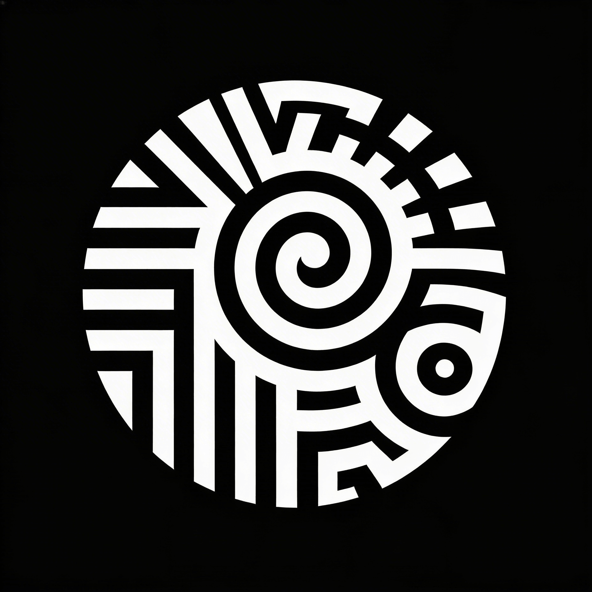

# Koda Documentation

This directory contains the public documentation for Koda as a product, platform, and open-source repository.

Use this index when you want to install, operate, evaluate, or contribute to Koda without reading implementation code first.

## Use Koda

- [Local install](install/local.md)
- [VPS install](install/vps.md)
- [Configuration reference](config/reference.md)
- [API reference](reference/api.md)
- the dashboard UI in `apps/web` is the main operator surface served on port `3000`

## Operate Koda

- [Architecture overview](architecture/overview.md)
- [Runtime architecture](architecture/runtime.md)
- [Object storage migration](install/object-storage-migration.md)
- [`docs/openapi/control-plane.json`](openapi/control-plane.json)

## Extend Koda

- [Architecture overview](architecture/overview.md)
- [Runtime architecture](architecture/runtime.md)
- [Configuration reference](config/reference.md)
- [AI guidance layer](ai/repo-map.yaml)

## Contribute To Koda

- [Contributing guide](../CONTRIBUTING.md)
- [Security policy](../SECURITY.md)
- [Code of conduct](../CODE_OF_CONDUCT.md)
- [Repository agent guide](../AGENTS.md)

## Documentation Conventions

- Public product and operator documentation lives in `docs/`.
- Repository guidance for agents, code assistants, and AI tooling lives in `docs/ai/`.
- The Python platform lives at the repository root and the official web UI lives in `apps/web/`.
- The maintained public HTTP contract lives in [`openapi/control-plane.json`](openapi/control-plane.json).
- Screenshots and diagrams in `docs/assets/` reflect real current product surfaces or architecture that exists in this repository today.
