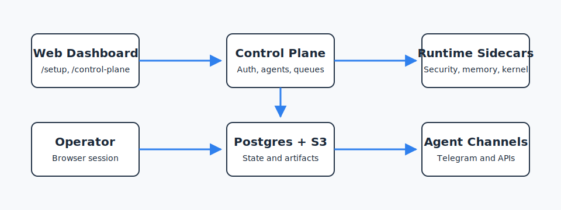

# Architecture Overview

Koda is a control-plane-first agent platform. The repository ships both the operator-facing product surfaces and the runtime services required to execute, ground, and supervise configurable AI agents in production-style environments across many domains.

## System Components

The platform is organized into a few stable domains:

- **Control plane:** setup, provider configuration, secrets, agent definitions, publication, and operator APIs
- **Runtime:** queue orchestration, execution supervision, runtime APIs, agent tools, and provider adapters
- **Knowledge:** retrieval, evidence sourcing, and operator-approved grounding context
- **Memory:** recall, extraction, curation, and durable semantic context
- **Artifacts:** ingestion, metadata, object-backed binaries, and evidence generation
- **Infrastructure:** Postgres, S3-compatible object storage, Docker, health checks, and bootstrap tooling

Koda is intentionally harness-oriented:

- it does not force a single niche, assistant persona, or task domain
- it supports multi-agent and multi-provider configurations as first-class operating patterns
- it separates infrastructure bootstrap from product configuration so operators can shape agents however they need

## Deployment Model

The official installation path is Docker-first:

- `app` runs the control plane and platform services
- `postgres` stores durable state
- `seaweedfs` provides the bundled S3-compatible object storage path
- `seaweedfs-init` bootstraps the required bucket before app startup

This topology is used for both local quickstart and the default single-node VPS deployment path.

## Control-Plane-First Configuration

Koda intentionally separates infrastructure bootstrap from product configuration:

- `.env` and Docker prepare the platform
- `/setup` and `/api/control-plane/*` configure the product
- providers, access policy, secrets, and agents are managed through the control plane

This keeps external layers such as reverse proxies, Tailscale, or VPS platforms thin and infrastructure-focused.

## State And Storage

Koda uses durable storage by default:

- Postgres is the source of truth for control-plane, runtime, memory, knowledge, and audit records
- object binaries and artifact payloads flow through a generic S3-compatible contract
- local disk is scratch-only and should not be treated as canonical state

## Public Surfaces

The main public entry points are:

- `/setup`
- `/api/control-plane/*`
- `/api/runtime/*`
- [`../openapi/control-plane.json`](../openapi/control-plane.json)

For the request/response lifecycle that powers these surfaces, continue with [Runtime Architecture](runtime.md).
