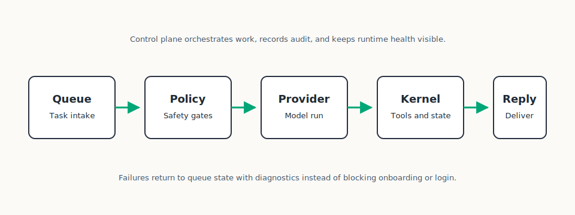

# Runtime Architecture

This document explains the main execution path of Koda once the platform is installed and configured.

## Execution Flow

1. A request reaches the platform through a supported interface such as Telegram or an operational control-plane path.
2. Handlers normalize input and pass it into the orchestration layer.
3. The runtime queue manager resolves the active agent, provider, prompt contract, and execution context.
4. Knowledge, memory, and artifact context are assembled when relevant.
5. The selected provider runtime executes the task, optionally entering the runtime tool loop.
6. Results, metadata, artifacts, and audit records are persisted through durable stores.
7. The final output is returned through the calling surface.

## Runtime Layers

### Handlers and Adapters

- Normalize input
- Enforce user access
- Route requests into the queue/runtime path

### Queue and Orchestration

- Maintain per-user and per-agent execution flow
- Resolve compiled prompt contracts and runtime configuration
- Coordinate memory recall, knowledge retrieval, and artifact analysis
- Handle provider fallback and execution lifecycle

### Provider Execution

- Run provider-specific CLIs and adapters
- Capture streaming or non-streaming results
- Manage canonical session continuity and operational metadata

### Runtime Tool Loop

- Parse runtime agent tool calls
- Enforce policy and approval constraints
- Execute bounded tool operations
- Feed structured tool results back into the active provider turn

### Persistence

- Store runtime state, audit trails, and durable metadata in Postgres
- Persist object-backed artifacts through the S3-compatible storage layer
- Keep scratch files outside the repository and outside canonical state

## Control Plane Relationship

The runtime does not own long-term product configuration. It consumes what the control plane publishes:

- agent definitions
- provider choices
- secrets and integration settings
- compiled prompt documents
- operational policies and environment defaults

This separation is what makes the install path predictable: infrastructure comes up first, product configuration is applied later through a stable control-plane surface.

## Operational Characteristics

- Fail closed when required bootstrap infrastructure is unavailable
- Keep memory and retrieval best-effort when possible, without silently bypassing hard security boundaries
- Expose health, doctor, and OpenAPI-backed public contracts for operators
- Preserve production-like topology in the quickstart stack to reduce drift between local and VPS installs
